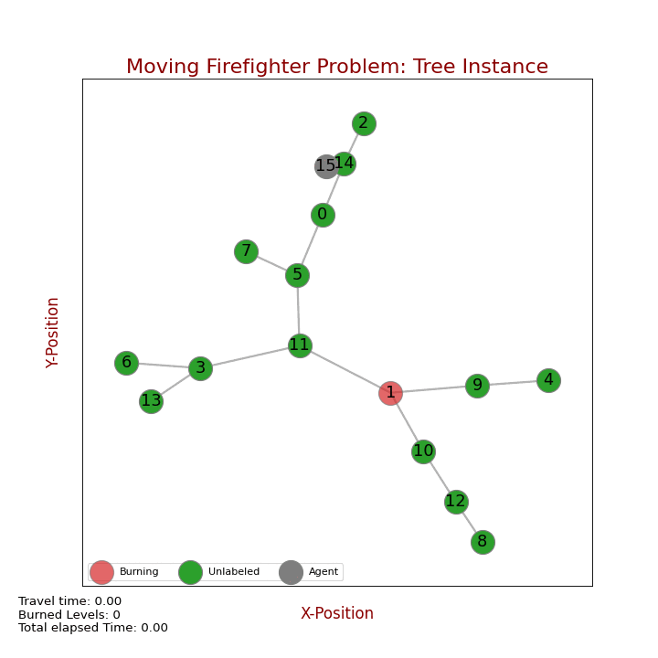
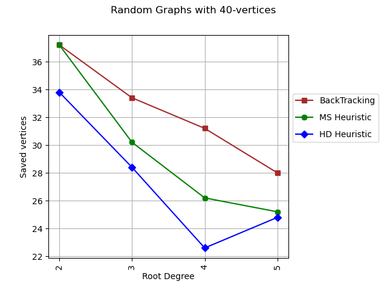

# Dynamic Programming Solver for the Moving Firefighter Problem on Trees

<p align="center">
  <a href="images/Dynaff.png"></a>  
</p>


Dynaff is a program that implements a Recursive Dynamic Programming algorithm. It begins by taking a tree generated by mfpgen and converts it into ete3 form.
From there, it constructs a key based on the state of the forest, considering attributes such as remaining time, agent position, and remaining nodes that are not already burning or defended.
This key is then stored in a hash table. The function proceeds to compute feasible nodes given the current state.
For each feasible node, it invokes the recurrence to determine the number of saved nodes until it reaches a 'Base Case'.
Subsequently, it traverses back with the computed values. Ultimately, the program generates a hash table with states as keys, each associated with its optimal 'next_node-value' pair.
A notable aspect of this approach is its efficiency in storing only states that currently occur in the hash table. This is crucial because, due to fire dynamics, certain states may never arise.

Dynaff accepts as input Experiments or Tree´s generated by [mfpgen](https://github.com/MauMontenegro/mfpgen).

### Usage

```console
python dynaffsolv.py -s SOLVER -i TREE_TYPE -e EXPERIMENT_PATH
```

Currently, Dynaff incorporates the following SOLVERS:
- Dynamic Programming: Implemented as *dp_solver*.
- Heuristic selecting the node with the highest degree for protection: Identified as *hd_heuristic*.
- Heuristic choosing the heaviest node (the one with the largest associated sub-tree) for protection: Named *ms_heuristic*.

For TREE_TYPE field:
- Trees embedded in a metric space: *rndtree*

### Example

Here, we present an example showcasing the performance of the dynamic programming algorithm applied to a tree of size 15.

<p align="center">
  <a href="images/MFFP_example.gif"></a>
  <p align="center"><em>Fig. 1 - Solution found by dynaff using the Dynamic Programming solver. Solution consists in the following path S={15,11,4,8} and saves 11 nodes.</em></p>  
</p>

---

Now, let's compare the performance of the dp_solver against the other implemented heuristics while varying the degree of the root.

<p align="center">
  <a href="images/BT_saved_rdegree.png"></a>
  <p align="center"><em>Fig. 2 Number of vertices saved by the three implemented solvers: DP (Backtracking), HD, and HS.</em></p>  
</p>


